## Recriando a interface do NETFLIX

Desafio de Projeto.

Recriando a interface do NETFLIX para o desafio de projeto do Bootcamp Carrefour Web Developer da DIO, utilizando HTML5, CSS3 e JS, o Photoshop para o tratamento das imagens como os banners e miniaturas dos filmes e séries, o programa HandBrake para otimizar o tamanho do trailer incorporado no plano de fundo do título em destaque.

Tecnologias e ferramentas utilizadas:

- HTML5
- CSS3
- JavaScript
- Plugin: JQuery / owl.carousel.js
- Photoshop
- HandBrake

### Páginas

***Página inicial, menu transparente e fixo no topo, ao rolar a página assume cor no plano de fundo.***

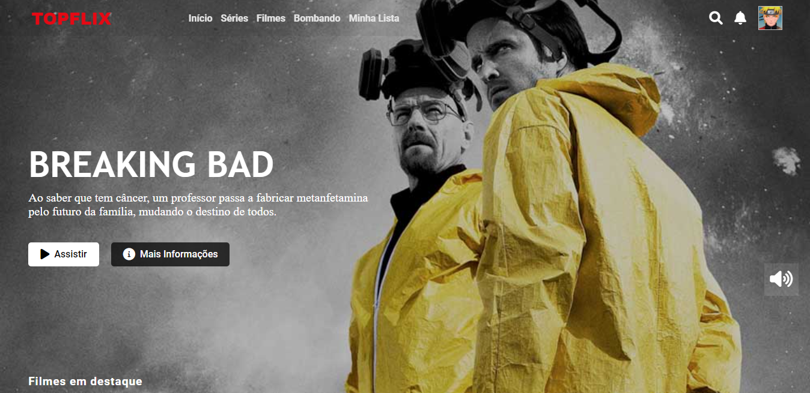

***Trailer da série executando no plano de fundo.***

**Página mais informações.**

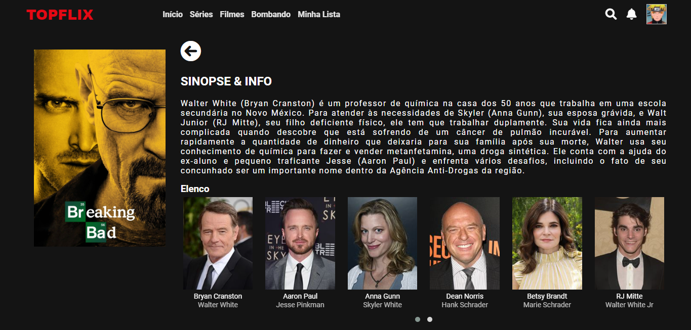

***Carrossel de filmes, séries, animes, top 10 e continuar assistindo.***

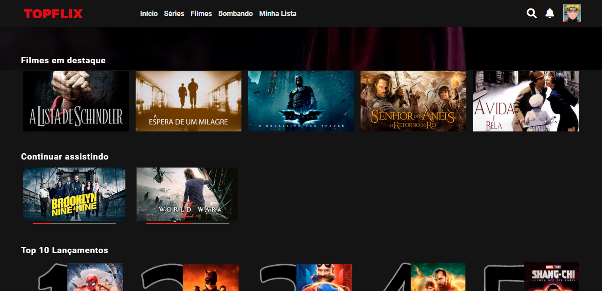

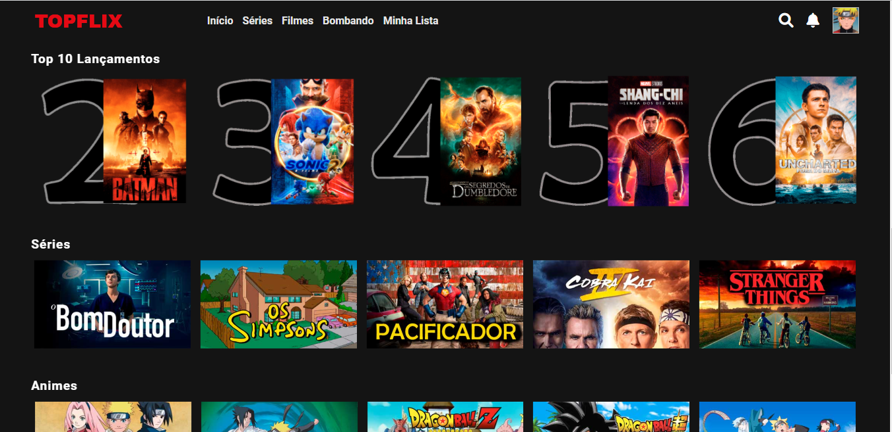

***Menu perfil, acesso ao clicar no ícone no topo da página à direita.***

**Página de seleção de Perfil**.

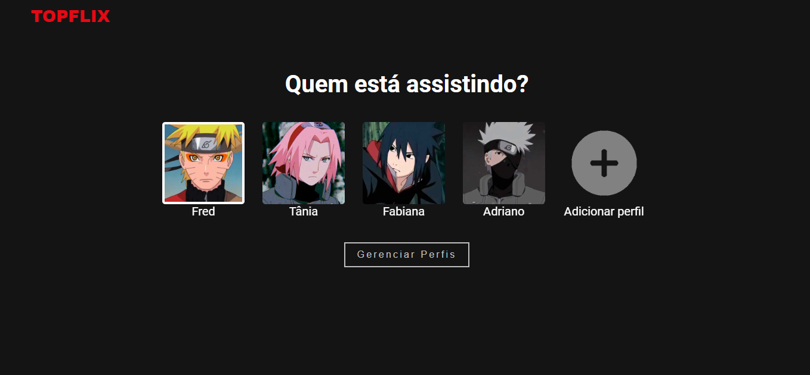

## Responsividade

**Responsividade (700px, 480px, 380px)** - Menu de perfil no estilo de carrossel.

**Tela 700px**

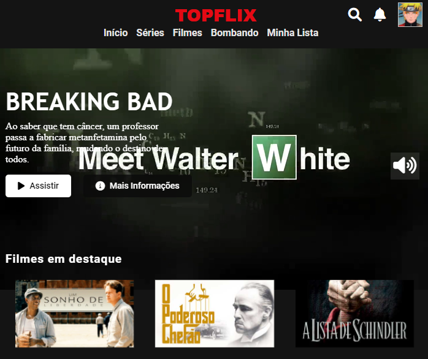

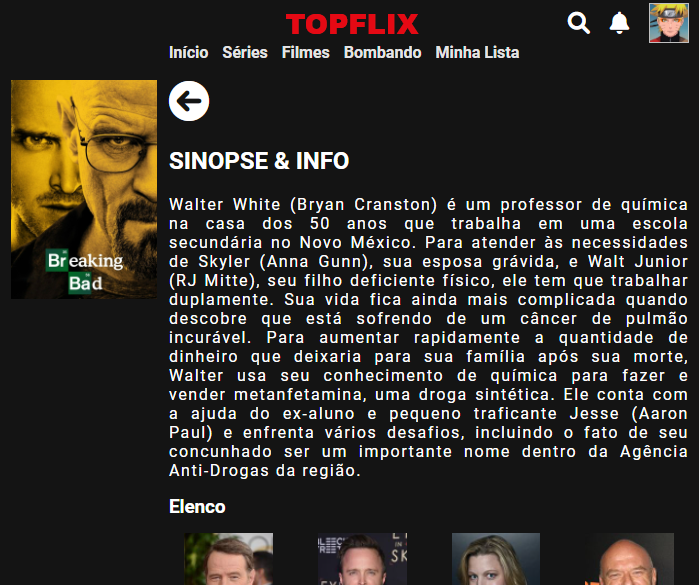

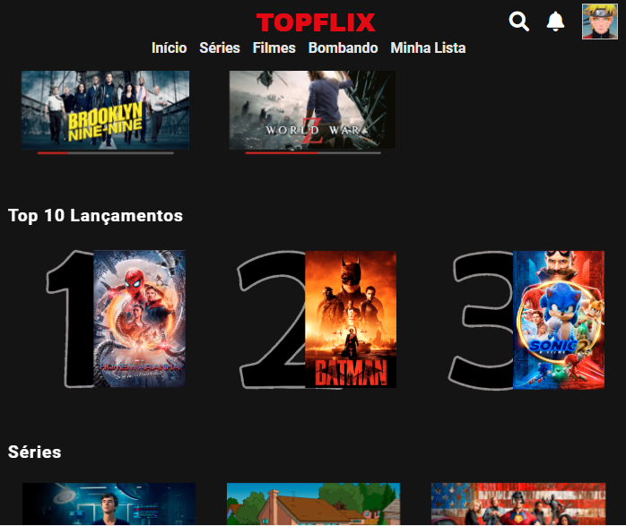

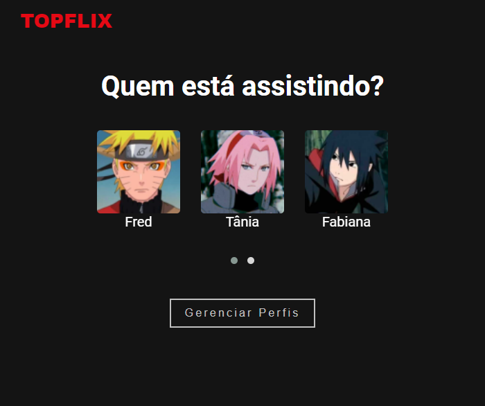

**Tela 480px**

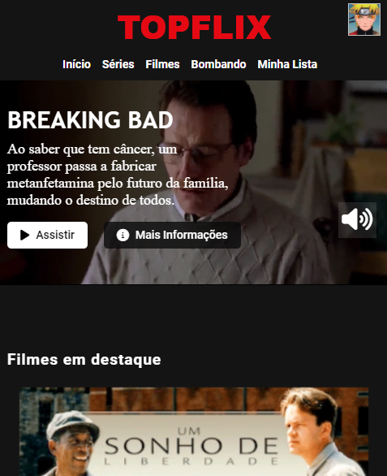

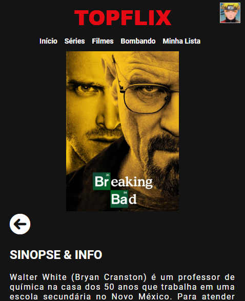

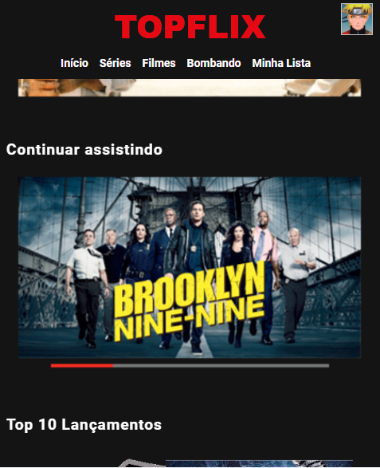

**Tela 380px**

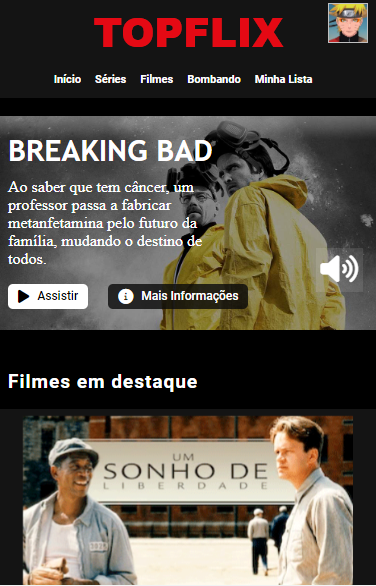

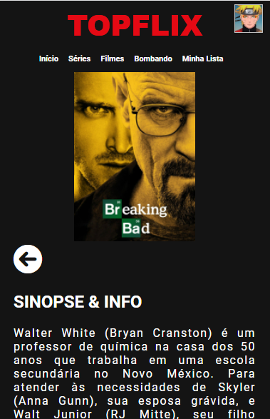

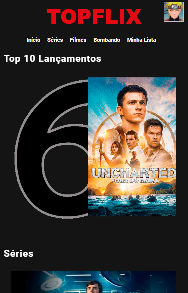

## Imagens e Vídeo

**Tratamento de imagens.**

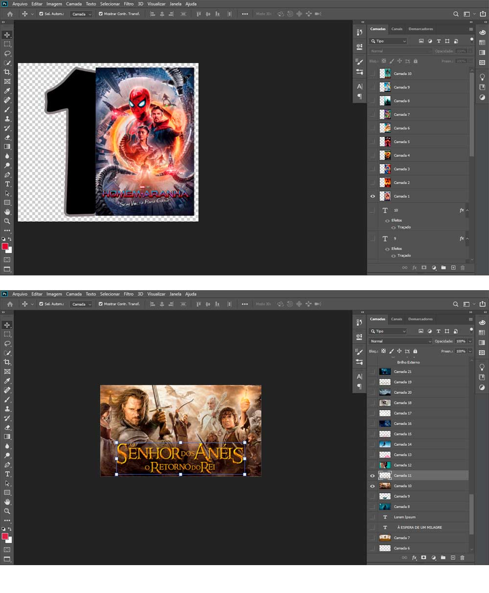

**HandBrake - Otimizar o tamanho do trailer.**

> Instrutor: Felipe Aguiar

> Bootcamp Carrefour Web Developer